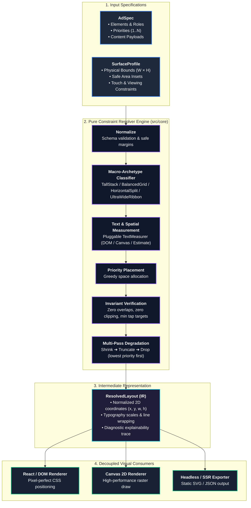
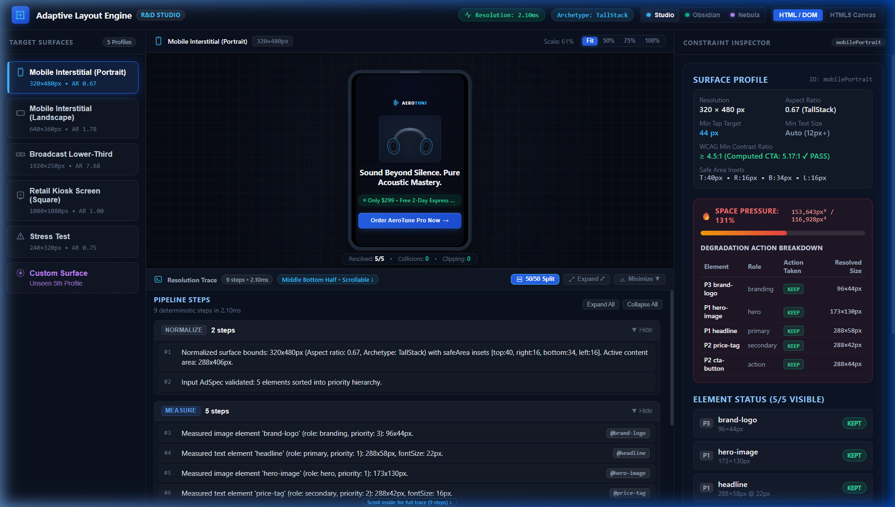
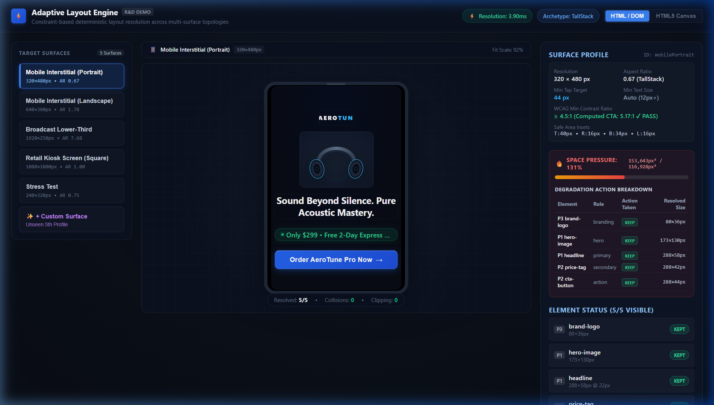
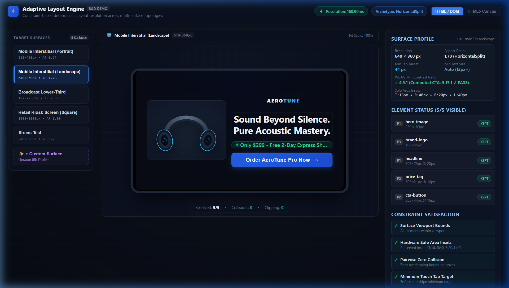
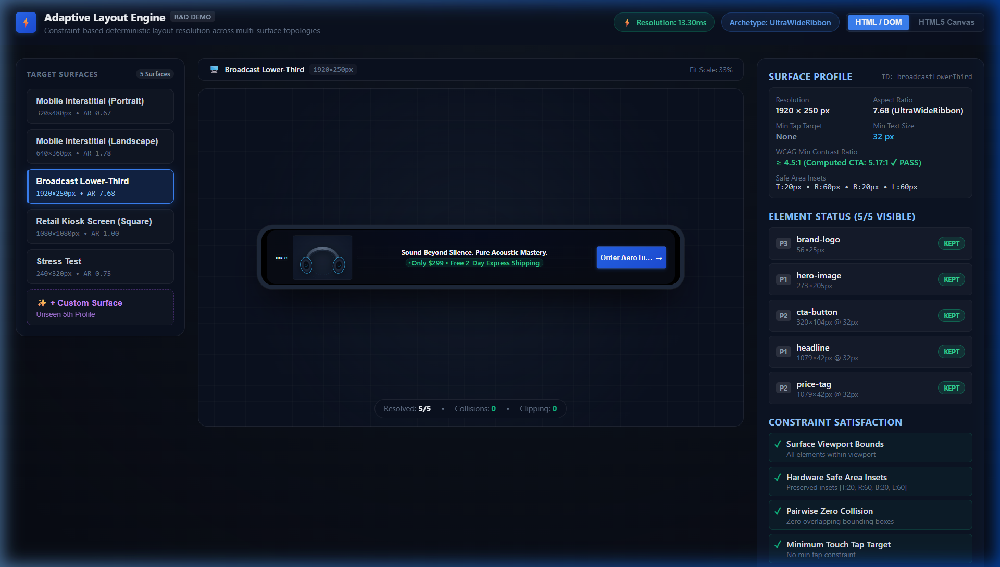
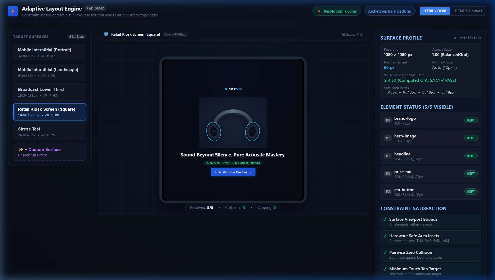
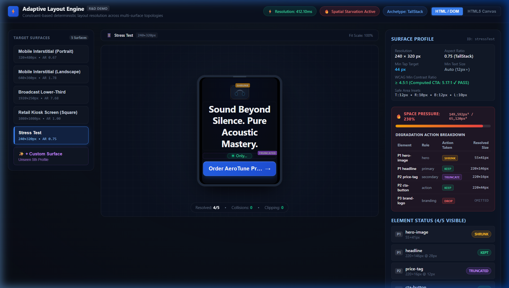
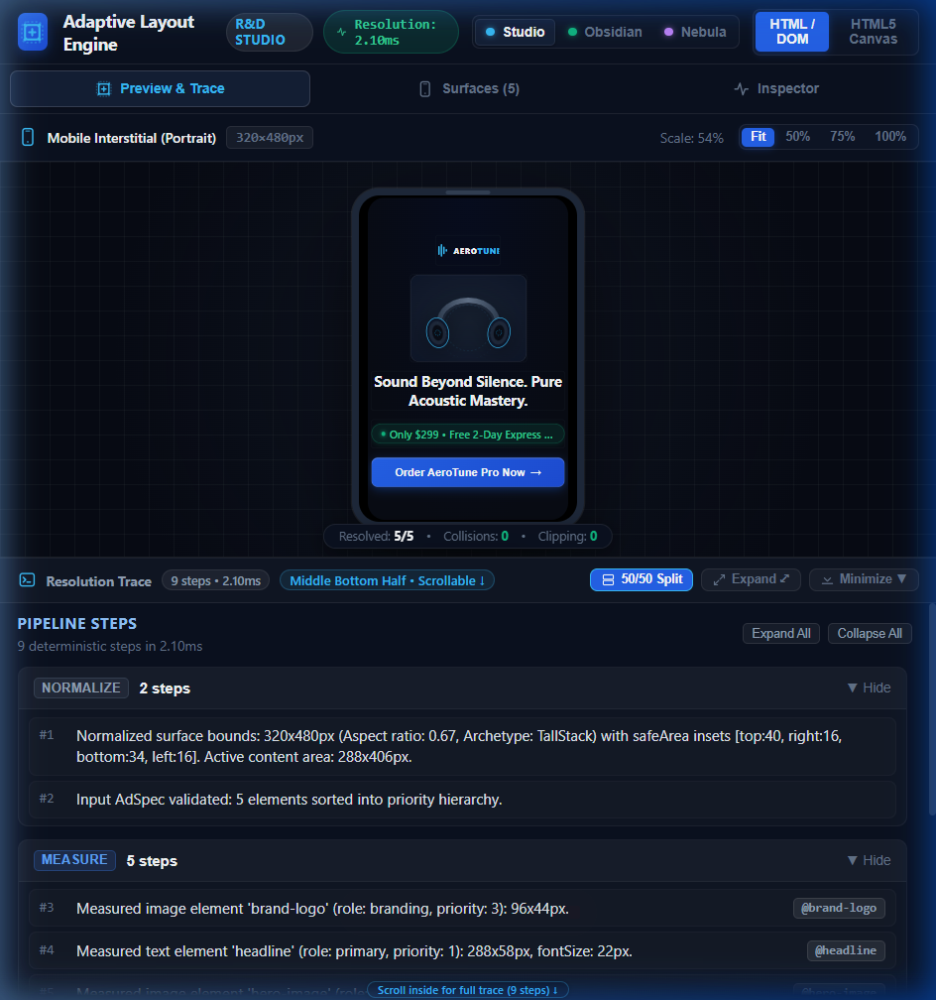
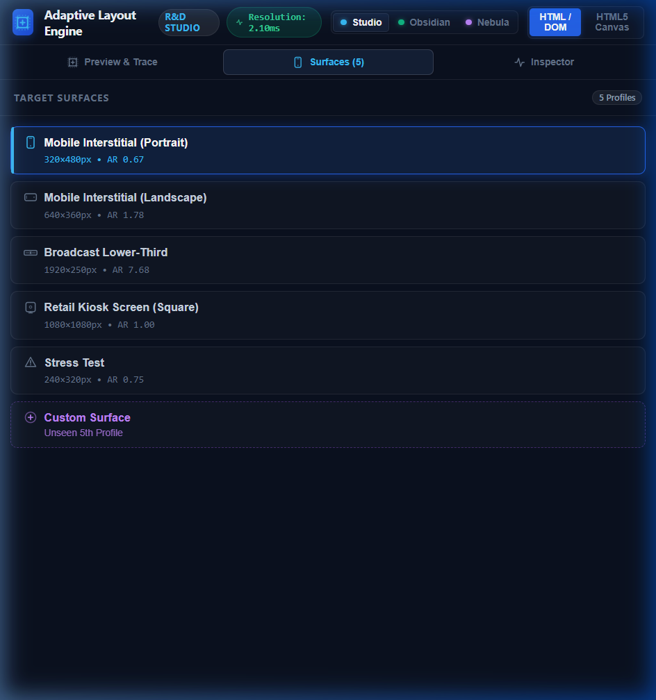
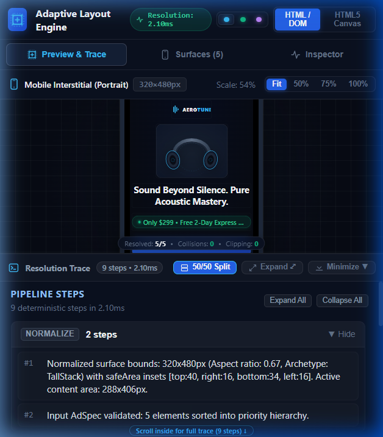

# Adaptive Layout Engine for Multi-Surface Ads

> **Live Interactive Studio**: [https://adaptive-layout-engine-for-multi-surface-ads.vercel.app/](https://adaptive-layout-engine-for-multi-surface-ads.vercel.app/)
> 
> [](https://adaptive-layout-engine-for-multi-surface-ads.vercel.app/)
> [](https://github.com/SAIKRISHNA2005/Adaptive-Layout-Engine-for-Multi-Surface-Ads)
> [](https://github.com/SAIKRISHNA2005/Adaptive-Layout-Engine-for-Multi-Surface-Ads)

Adaptive Layout Engine is a framework-agnostic TypeScript constraint resolver that transforms a declarative advertising specification into a validated layout for arbitrary display surfaces. Rather than relying on rigid CSS media queries, viewport hacks, or fragile per-surface branching, the engine uses a deterministic, priority-ordered geometric pipeline. It maps semantic ad components—hero media, headline copy, value propositions, branding logos, and calls-to-action—across heterogeneous aspect ratios and physical contexts (ranging from mobile interstitials and horizontal mobile feeds to ultra-wide broadcast lower-thirds and square retail kiosks) while guaranteeing zero element overlap, zero boundary clipping, and strict compliance with hardware safe areas, touch accessibility standards, and distance-based text legibility.

---

## Architecture Flow



---

## Visual Gallery Across Surfaces & Endpoints

### 1. Studio Development Environment (50/50 Center Split & Docked Trace)
The developer studio features a zero-window-scroll layout (`100vh`) with a central 50/50 vertical split between the live ad preview canvas and the expandable resolution trace console:



### 2. Multi-Surface Form Factors
The engine dynamically selects topological macro-archetypes based on aspect ratio and physical constraints:

| Surface Preset | Dimensions & AR | Archetype Strategy | Rendered Preview |
| :--- | :--- | :--- | :--- |
| **Mobile Interstitial (Portrait)** | 320×480px<br>AR: 0.67 | `TallStack`<br>(Centered vertical column) |  |
| **Mobile Interstitial (Landscape)** | 640×360px<br>AR: 1.78 | `HorizontalSplit`<br>(2-column media/copy split) |  |
| **Broadcast Lower-Third** | 1920×250px<br>AR: 7.68 | `UltraWideRibbon`<br>(1-row horizontal stream) |  |
| **Retail Kiosk Screen (Square)** | 1080×1080px<br>AR: 1.00 | `BalancedGrid`<br>(High-res balanced media/action) |  |
| **Stress Test Surface** | 240×320px<br>Extreme Constraint | Multi-Pass Degradation<br>(Preserves CTA, drops branding) |  |

### 3. Responsive Breakpoints & Mobile Studio
On tablet and mobile devices ($\le 860\text{px}$), the studio seamlessly switches to an integrated segment bar (`Preview & Trace`, `Surfaces`, `Inspector`) with dynamic canvas scaling:

| Tablet: Preview & Trace | Tablet: Surface Preset Selector | Mobile Viewport (375×667) |
| :---: | :---: | :---: |
|  |  |  |

---

## Setup & Running Instructions

### Prerequisites
- **Node.js**: v18.0.0 or higher
- **npm**: v9.0.0 or higher

### 1. Installation
Clone the repository and install dependencies:
```bash
git clone https://github.com/SAIKRISHNA2005/Adaptive-Layout-Engine-for-Multi-Surface-Ads.git
cd Adaptive-Layout-Engine-for-Multi-Surface-Ads
npm install
```

### 2. Development Server
Start the local Vite development server:
```bash
npm run dev
```
Open [http://localhost:5173](http://localhost:5173) in your browser to inspect the studio interface, or access the live deployed studio at [https://adaptive-layout-engine-for-multi-surface-ads.vercel.app/](https://adaptive-layout-engine-for-multi-surface-ads.vercel.app/).

### 3. Running Automated Tests
Run the comprehensive test suite (17 test files, 108 tests including property-based testing):
```bash
npm test -- --run
```

### 4. Production Build & Type Checking
Verify TypeScript compilation and generate the production bundle:
```bash
npm run build
```

---

## How to Run the Demo & Test Features

### Surface Switching
- **Desktop**: Click on any surface preset card in the left sidebar (`Mobile Interstitial (Portrait)`, `Mobile Interstitial (Landscape)`, `Broadcast Lower-Third`, `Retail Kiosk Screen`, or `Stress Test`).
- **Tablet / Mobile**: Use the top segment bar to navigate to the **Surfaces** tab, tap a surface preset, and return to **Preview & Trace**.

### Creating Custom Surfaces
1. Click the **`+ New Surface`** button at the bottom of the surface picker sidebar.
2. In the modal dialog, configure:
   - **Surface Name** & **Unique ID**
   - **Width & Height** (in pixels)
   - **Safe Area Insets** (Top, Right, Bottom, Left margins for notches or broadcast margins)
   - **Minimum Tap Target** (e.g., 44px for standard touch, 60px for kiosk)
   - **Minimum Text Size** (e.g., 14px for handheld, 32px for 10-foot TV viewing)
   - **Viewing Distance** (`near`, `medium`, or `far`)
   - **Touch Display** toggle
3. Click **Save & Resolve**. The resolver will immediately compute coordinates for the new surface and display it in the viewport without any code changes.

### Developer Tooling & Inspection
- **Renderer Toggle**: Switch between **DOM** and **Canvas 2D** backends in the top toolbar to confirm identical layout output.
- **Trace Console Modes**: Use the header controls on the bottom dock to toggle between **Half-View** (50/50 split with peek affordance), **Expand** (expansive console view), and **Collapse** (maximized preview canvas).
- **Interactive Element Inspection**: Hover over any element in the ad preview to highlight its calculated bounding box and view its constraint status in the right inspector.
- **Theme Switcher**: Select between **Studio Dark**, **Obsidian Minimal**, and **Cyber Nebula** themes in the top-right header.

---

## How the Algorithm Works (5-Minute Overview)

The resolver operates as a deterministic, pure functional pipeline executing in 5 stages:

```text
Normalize ──► Measure ──► Place ──► Validate ──► Degrade
```

### 1. Stage-by-Stage Pipeline
1. **Normalize**: Validates input schemas using Zod. Subtracts physical safe area insets (e.g., smartphone notches, TV title-safe margins) from surface dimensions to establish the available working area. Determines the geometric **macro-archetype** directly from the surface aspect ratio ($\text{AR} = \frac{W}{H}$):
   - `TallStack` ($\text{AR} < 0.85$): Centered vertical stack for portrait devices.
   - `BalancedGrid` ($0.85 \le \text{AR} \le 1.35$): Media top, headline middle, actions bottom for square kiosks.
   - `HorizontalSplit` ($1.35 < \text{AR} \le 3.5$): 2-column layout (hero media left, copy/actions right) for landscape displays.
   - `UltraWideRibbon` ($\text{AR} > 3.5$): Single horizontal row partitioned into branding, hero media, copy block, and trailing CTA for broadcast strips.
2. **Measure**: Computes intrinsic and minimum bounding boxes for all elements using a pluggable `TextMeasurer` abstraction. Calculates multi-line font wrapping thresholds and ensures button hit boxes satisfy `minTapTarget`.
3. **Place**: Positions elements into topological zones defined by the chosen archetype according to element priority ladders.
4. **Validate**: Verifies the tentative layout against hard physical invariants. Computes a multi-objective fitness score $[0, 100]$ evaluating visibility, degradation penalties, visual centroid balance, and whitespace economy.
5. **Degrade**: If content overflows available space or violates hard constraints, the engine initiates targeted, multi-pass degradation.

### 2. Priority & Multi-Pass Degradation Model
Elements are assigned semantic priorities from Priority 1 (highest) to Priority 5 (lowest):
- **Priority 1 (Essential Core)**: Hero Image (`role: hero`), Headline Copy (`role: primary`).
- **Priority 2 (Conversion Engine)**: Call-to-Action Button (`role: action`), Price Tag (`role: secondary`).
- **Priority 3 (Secondary Context)**: Brand Logo (`role: branding`).

When space diminishes, the engine executes four progressive degradation passes:
- **Pass 1 (Non-destructive adjustments)**: Margins and paddings shrink; font sizes scale down towards `surface.minTextSize`; hero images scale down preserving aspect ratios.
- **Pass 2 (Progressive keyword truncation)**: Long text copy compacts to essential short phrases with ellipsis (`...`).
- **Pass 3 (Selective dropping)**: Elements explicitly declared with `canDrop: true` drop out in strict inverse priority order (e.g., Brand Logo drops before Price Tag; CTA never drops).
- **Pass 4 (Spatial starvation emergency containment)**: On micro-displays (e.g. 100×100px), non-action elements drop to protect the core interactive CTA button from boundary clipping.

### 3. Hard vs. Soft Constraints
- **Hard Constraints (Zero Tolerance)**: Non-negotiable physical laws. Boundary containment, pairwise non-overlap, minimum tap targets, and distance-based text size must be satisfied 100%. Any candidate violating a hard constraint is invalid ($\text{Score} = -\infty$).
- **Soft Constraints (Optimization Preferences)**: Used to score and rank valid layouts based on whitespace distribution, visual balance, and deviation from ideal dimensions.

---

## Known Limitations

1. **Fixed Element Type Set**: The current engine is scoped specifically to advertising domains supporting `text`, `image`, and `button` element types. Rich interactive widgets, form inputs, or nested vector components are not supported.
2. **Fallback Measurement in Headless Environments**: In browser environments, the engine uses real offscreen DOM elements or Canvas 2D contexts for pixel-perfect font metrics. In pure Node.js/CI environments where DOM/Canvas APIs are absent, it falls back to `EstimateTextMeasurer`, an approximation heuristic that may differ by $\pm 5\%$ on unusual custom web fonts.
3. **No Database Persistence**: The studio operates entirely as an in-memory client-side application. Custom surfaces created via the modal dialog are persisted in React component state and will reset upon a hard browser reload.
4. **Archetype-Directed Partitioning vs. Generalized 2D Linear Solver**: The engine utilizes 4 discrete macro-archetypes rather than a generalized continuous 2D linear-programming solver (e.g. Cassowary). While this guarantees sub-millisecond execution and explainable diagnostics, it does not explore arbitrary non-standard multi-column tiling patterns.
5. **Single Rectangular Viewports**: Layouts are resolved against single 2D rectangular bounding boxes with orthogonal safe area insets; non-rectangular screens (e.g. circular smartwatch displays, curved displays) are not modeled.

---

## Time Spent

Approx. 5 hours over 1 day (architecture blueprinting, pure constraint resolver engine, property-based invariants testing, multi-backend DOM/Canvas rendering, studio UX with 50/50 split and resolution trace, and technical documentation).

---

## AI-Assisted Development Disclosure

In compliance with the assignment disclosure guidelines, generative AI tools were utilized during the development of this project.

### Tools Used
- **Claude (Anthropic)**: Architecture blueprinting, algorithmic planning, and TypeScript implementation.
- **Gemini / Antigravity Agent (DeepMind)**: IDE agent integration, automated tool orchestration, browser subagent visual verification, and test execution.
- **GitHub Copilot**: Inline code completion and boilerplate typing.

### Division of Responsibility

#### AI Was Used For:
- **Scaffolding & Boilerplate**: Generating initial React component shells, CSS variable foundations, and Vite test configurations.
- **Test Generation**: Drafting extensive Vitest unit tests, property-based test suites with `fast-check`, and mock DOM harness configurations.
- **Edge-Case Brainstorming**: Proposing stress-test geometries (e.g. zero safe areas, extreme aspect ratios, identical element priorities).
- **Type Safety Reviews**: Scanning for unchecked type assertions, missing discriminating union properties, and linting rules.
- **Documentation & UI Styling Suggestions**: Drafting initial ADR templates and designing bespoke SVG icons.

#### Human-Owned Decisions:
- **The Constraint Resolution Model**: Conceiving the priority-ordered topological partitioning pipeline and rejecting continuous linear programming solvers (Cassowary/Simplex) in favor of deterministic macro-archetypes.
- **Hard vs. Soft Constraint Separation**: Establishing the strict invariant rule that physical boundaries, overlaps, tap targets, and legibility are binary physical laws rather than penalty weights.
- **Degradation Semantics**: Defining the multi-pass degradation sequence (non-destructive shrink $\to$ keyword truncation $\to$ selective dropping $\to$ emergency containment) and enforcing the absolute protection of conversion CTAs over branding logos.
- **Architecture Boundaries**: Enforcing the strict decoupling of the 100% pure TypeScript core from browser DOM/Canvas rendering consumers.
- **Code Review & Quality Auditing**: Conducting adversarial code review passes, eliminating all hidden surface identity branches, removing `any` casts, and validating final layout correctness.
