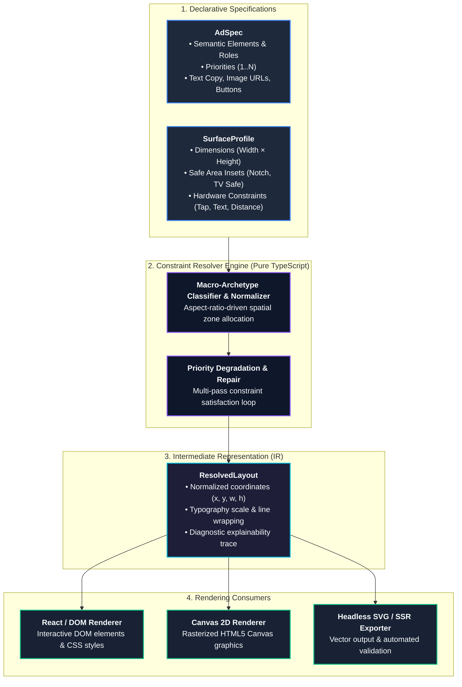
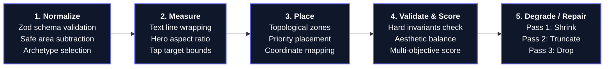
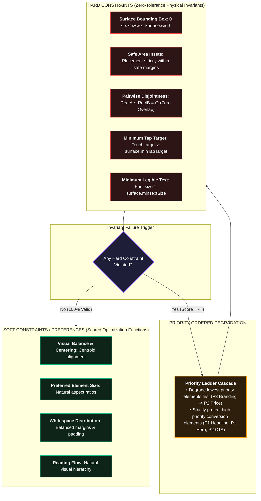
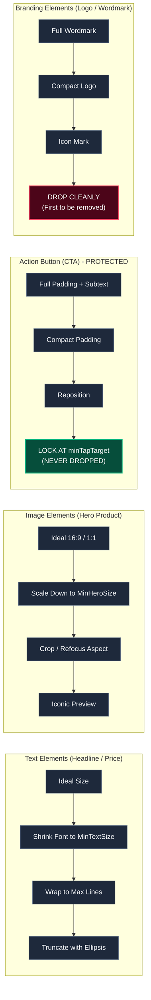
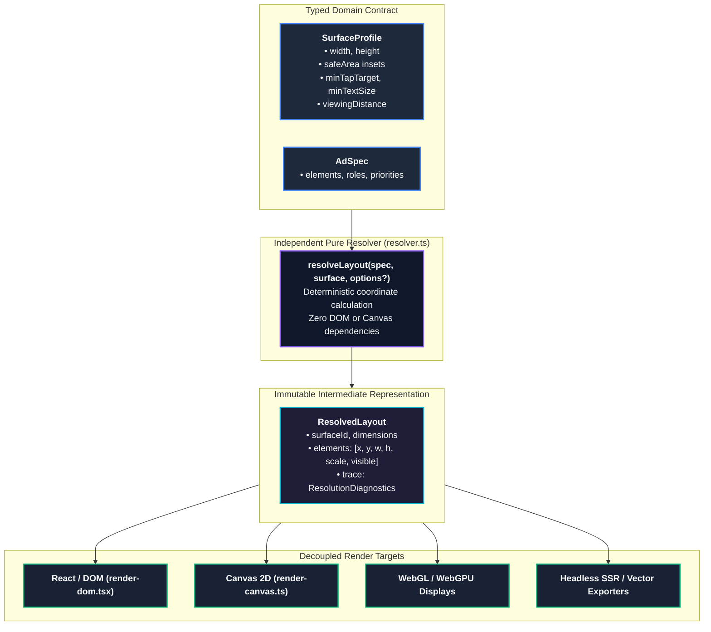

# Architecture Blueprint: Adaptive Layout Engine for Multi-Surface Ads

## 1. End-to-End Data Flow

The Adaptive Layout Engine models multi-surface ad layout as a deterministic, constraint-guided geometric pipeline. It takes an abstract, surface-agnostic description of ad content and a physical surface specification, and generates a concrete coordinate mapping that can be consumed by any rendering backend.



### Why the Resolver Must Be 100% Framework-Agnostic
1. **Separation of Concerns**: Layout calculation is pure geometry, typography math, and constraint resolution. Tying resolution to DOM elements, browser layout passes (`getBoundingClientRect`), or React component lifecycles makes testing slow, non-deterministic, and impossible in headless environments (e.g., automated CI test suites, edge SSR workers, or batch pre-rendering).
2. **Pluggable Render Targets**: By producing an Intermediate Representation (`ResolvedLayout`) containing absolute normalized rectangles, typographic scales, and clipping flags, any rendering engine (DOM, HTML5 Canvas, WebGL, SVG, or Native Mobile) can render the ad with zero code changes to the resolver.
3. **Purity & Testability**: A pure function `resolve(spec, surface, options?): ResolvedLayout` guarantees reproducibility: given the exact same `AdSpec` and `SurfaceProfile`, the layout output is bit-for-bit identical across all platforms and execution environments.

---

## 2. Resolver Internal Pipeline Stages

The layout engine executes a deterministic 5-stage pipeline to resolve constraints systematically and explainably:



### 1. Normalize (`normalize`)
- **Responsibility**: Validates input `AdSpec` and `SurfaceProfile` against runtime Zod schemas. Computes effective canvas bounds after subtracting hardware/platform `safeArea` insets. Derives the geometric macro-archetype from aspect ratio ($\text{AR} = \frac{W}{H}$) and establishes the working coordinate space.
- **Inputs**: Raw `AdSpec`, Raw `SurfaceProfile`.
- **Outputs**: Sanitized `NormalizedSpec`, `ActiveWorkingArea` bounding box, and classified `LayoutArchetype`.

### 2. Measure (`measure`)
- **Responsibility**: Computes intrinsic, minimum, and ideal dimensions for each element via the pluggable `TextMeasurer` abstraction (`DOMTextMeasurer`, `CanvasTextMeasurer`, or `EstimateTextMeasurer`). Computes multi-line text wrapping thresholds, image aspect ratios, and button tap-target hit boxes.
- **Inputs**: `NormalizedSpec`, `SurfaceProfile`, `TextMeasurer`.
- **Outputs**: Map of `ElementId -> ElementMeasurement` (intrinsic dimensions, line wrapping boundaries, tap target bounds).

### 3. Place (`place`)
- **Responsibility**: Positions elements within the selected macro-archetype topology:
  - `TallStack` ($\text{AR} < 0.85$, e.g., Mobile Portrait): Single-column centered vertical stack.
  - `BalancedGrid` ($0.85 \le \text{AR} \le 1.35$, e.g., Retail Kiosk): Media top, headline/content middle, actions bottom with balanced padding.
  - `HorizontalSplit` ($1.35 < \text{AR} \le 3.5$, e.g., Mobile Landscape): 2-column layout (hero media left, copy and actions right).
  - `UltraWideRibbon` ($\text{AR} > 3.5$, e.g., Broadcast Lower-Third): Single horizontal row partitioned into branding, hero media, copy block, and trailing CTA.
- **Inputs**: `LayoutArchetype`, `ElementMeasurement` map, `ActiveWorkingArea`.
- **Outputs**: Tentative `SpatialPlacementMap` containing un-validated `(x, y, w, h)` bounding boxes for all active elements.

### 4. Validate & Score (`validate`)
- **Responsibility**: Evaluates the tentative placement against all hard constraints (boundary containment, pairwise non-overlap, minimum tap targets, minimum font sizes). Computes a multi-objective fitness score considering content utilization, visual hierarchy preservation, and whitespace balance.
- **Inputs**: Tentative `SpatialPlacementMap`, `SurfaceProfile`, Hard/Soft constraint definitions.
- **Outputs**: `ValidationResult` (boolean valid, list of violation tokens) and `CandidateScore` (numerical fitness metric).

### 5. Degrade / Repair (`degrade`)
- **Responsibility**: If hard constraint validation fails or spatial starvation occurs, executes targeted degradation passes in strict priority order (lowest priority $P_N$ to highest $P_1$):
  - *Pass 1 (Non-destructive adjustments)*: Shrink padding, scale font size down towards `minTextSize`, scale hero image.
  - *Pass 2 (Progressive keyword truncation)*: Compact text copy to essential keywords with ellipsis (`...`).
  - *Pass 3 (Selective dropping)*: Drop lower-priority optional elements marked with `canDrop: true` (e.g. secondary copy, price tag, branding logo).
  - *Pass 4 (Spatial starvation emergency containment)*: Non-action elements drop to protect the core CTA button from boundary clipping.
- **Inputs**: Failing `SpatialPlacementMap`, list of constraint violations, priority queue.
- **Outputs**: Repaired `SpatialPlacementMap` with guaranteed zero overlaps and zero clipping.

### Diagnostics & Telemetry
Every stage records events to a `DiagnosticsCollector`, producing an explainable, step-by-step `ResolutionDiagnostics` audit report detailing decisions, duration, and constraint satisfaction.

---

## 3. Hard vs. Soft Constraints & Priority Model

To achieve predictable adaptation without fragile heuristics, the engine strictly categorizes all constraints into two distinct tiers:



### Hard Constraints
Hard constraints represent physical and legal boundaries. A candidate layout that violates any single hard constraint has a score of $-\infty$ and is invalid:
1. **Surface Bounds**: All visible elements must fit strictly inside $[0, W_{\text{surface}}] \times [0, H_{\text{surface}}]$.
2. **Safe Area Insets**: Elements must not penetrate reserved hardware cutouts (e.g., notch, home bar) or broadcast TV title-safe zones.
3. **Pairwise Disjointness**: No two visible elements may overlap bounding rectangles ($\forall i \neq j, \text{Rect}_i \cap \text{Rect}_j = \emptyset$).
4. **Minimum Tap Target**: On touch surfaces (e.g., `retailKiosk`, `mobileInterstitial`), interactive elements (buttons/CTAs) must have both width and height $\ge \text{minTapTarget}$ (e.g., 44px on mobile, 60px on kiosk).
5. **Minimum Legible Text Size**: On surfaces viewed from afar (e.g., `broadcastLowerThird`), text elements must never render below $\text{minTextSize}$ (e.g., 32px), even if shrinking font size would otherwise avoid an overflow.

### Soft Constraints & Objective Scoring
Soft constraints guide candidate ranking when multiple valid configurations exist. Soft penalties penalize deviations from ideal design intent:
$$\text{Score} = w_{\text{vis}} \cdot \text{VisibilityScore} - w_{\text{dist}} \cdot \text{DistortionPenalty} - w_{\text{white}} \cdot \text{WhitespaceVariance} - w_{\text{deg}} \cdot \text{DegradationPenalty}$$

---

## 4. Degradation Ladder per Element Type

When available screen area is insufficient to satisfy all elements at their ideal sizes, the engine degrades elements along deterministic, role-specific ladders ordered strictly from lowest priority ($P_N$) to highest priority ($P_1$).



### Strict Protection Invariant: CTA vs. Branding
- **CTA (Priority 2, Role: `action`)** is an essential conversion anchor. It is strictly protected from being dropped. It may shed accessory icons or padding, but its interactive hit box is locked at or above `surface.minTapTarget`.
- **Branding (Priority 3, Role: `branding`)** provides secondary context. If space diminishes, branding will shed secondary text, scale down, migrate to available secondary margins, and finally **drop out completely** before the CTA or Hero image is compromised.

---

## 5. Extensibility: Adding Surfaces & Renderers Without Modifying the Resolver

The system is decoupled through typed domain contracts:



### Adding a New Surface Profile (e.g. Ultra-Wide Billboard or Smartwatch)
To add a new surface, one simply defines a new `SurfaceProfile` object conforming to the interface:
```typescript
export interface SurfaceProfile {
  id: string;
  name: string;
  width: number;
  height: number;
  safeArea?: { top: number; right: number; bottom: number; left: number };
  minTapTarget?: number;
  minTextSize?: number;
  viewingDistance?: "near" | "medium" | "far";
  touchOnly?: boolean;
}
```
The resolver never checks `if (surface.id === "mobile")`. Instead, it reads `width`, `height`, `minTapTarget`, `minTextSize`, and aspect ratio dynamically. Any arbitrary 5th profile provided during testing will resolve automatically.

### Adding a New Renderer (e.g. WebGL, SVG, PDF)
Renderers consume only the resolved IR:
```typescript
export interface ResolvedLayout {
  surfaceId: string;
  dimensions: { width: number; height: number };
  elements: ResolvedElement[];
  trace: ResolutionTrace;
}
```
A renderer has zero awareness of constraints, priorities, or degradation algorithms; it is simply a pure projection of 2D bounding boxes and styles.

---

## 6. What We Are Explicitly NOT Building (Scope Boundaries)

In accordance with the assignment's explicit guidance, we intentionally avoid over-engineering:

1. **No General Linear Programming / Simplex Solver**:
   - *Rationale*: General LP solvers (like Cassowary or Simplex) are heavyweight, non-transparent, and struggle with non-linear discrete degradation (such as dropping an element or switching text line wrapping). A priority-ordered spatial partition and greedy degradation cascade is fully deterministic, $O(N \log N)$, easily debugged, and explainable step-by-step.
2. **No Dynamic Plugin Architecture**:
   - *Rationale*: A single ad domain with well-defined element roles (`hero`, `primary`, `action`, `secondary`, `branding`) does not warrant dynamic runtime plugin loaders or foreign module registries. We keep the core typed and compact.
3. **No Animation / Physics Engine in the Core Resolver**:
   - *Rationale*: The resolver's sole output is a static, deterministic geometric state. Layout transitions and animations belong exclusively in the presentation/rendering layer (e.g. CSS transitions or React motion wrappers in the demo UI).

---

## 7. Architectural Decisions & Production Implementation Alignment

The design questions originally identified during preliminary research were resolved as follows:

1. **Scoring Model: Multi-Objective Fitness Evaluation**:
   - *Production Solution*: Implemented in `src/core/scoring.ts`. Evaluates layout candidates on a normalized $[0, 100]$ scale across four dimensions:
     - Visibility Weight (40%): Rewards keeping declared elements visible, heavily penalizing drops of higher-priority items.
     - Degradation Penalties (30%): Deducts points for font shrinkage, text truncation, and hero scale reductions.
     - Visual Balance (20%): Evaluates horizontal and vertical centroid centering and alignment consistency.
     - Whitespace Economy (10%): Rewards balanced content fill factor avoiding extreme dead space or overcrowding.

2. **Measurement Engine Abstraction in Heterogeneous Environments**:
   - *Production Solution*: Implemented `TextMeasurer` strategy interface (`src/measurement/`).
     - In live React browser demo: `DOMTextMeasurer` uses offscreen cached DOM elements for pixel-perfect line wraps.
     - In Canvas rendering: `CanvasTextMeasurer` uses `CanvasRenderingContext2D` or `OffscreenCanvas`.
     - In headless CI/Vitest: `EstimateTextMeasurer` provides deterministic font-aspect heuristics with zero binary dependencies.

3. **Macro Archetype Partitioning**:
   - *Production Solution*: Formally implemented 4 geometric archetypes in `src/core/resolver.ts` derived dynamically from surface aspect ratio ($\text{AR} = \frac{W}{H}$):
     - `TallStack` ($\text{AR} < 0.85$, e.g., Mobile Portrait)
     - `BalancedGrid` ($0.85 \le \text{AR} \le 1.35$, e.g., Retail Kiosk Screen)
     - `HorizontalSplit` ($1.35 < \text{AR} \le 3.5$, e.g., Mobile Landscape)
     - `UltraWideRibbon` ($\text{AR} > 3.5$, e.g., Broadcast Lower-Third)

